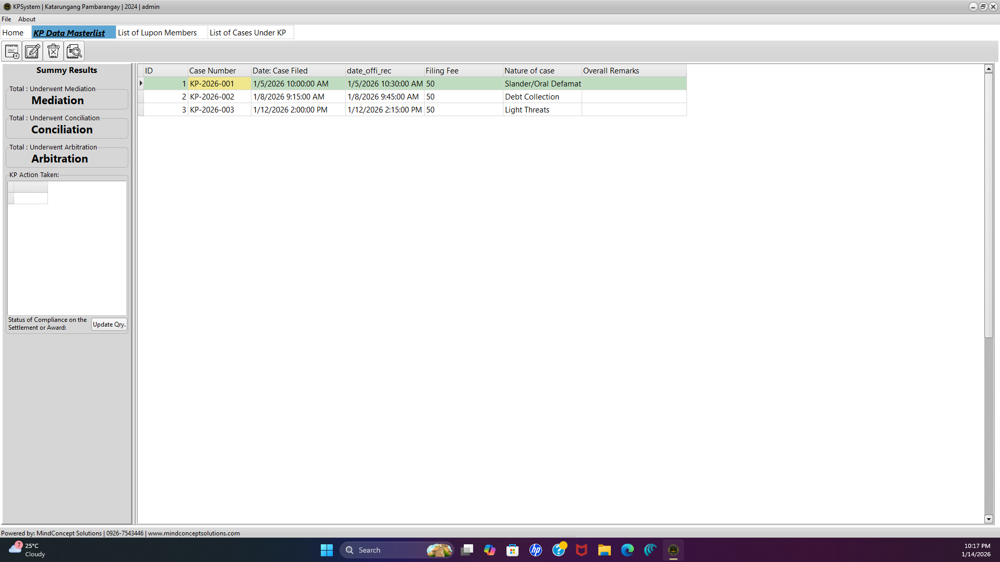
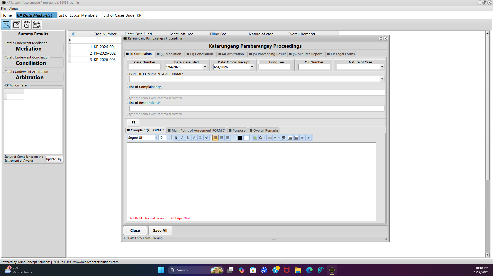
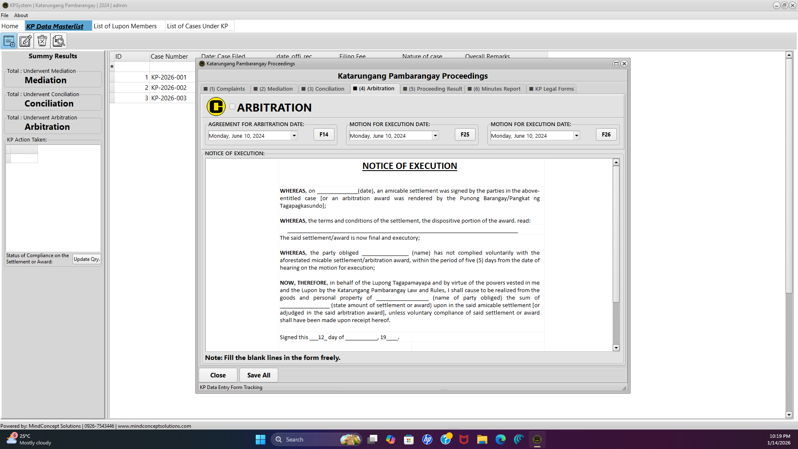
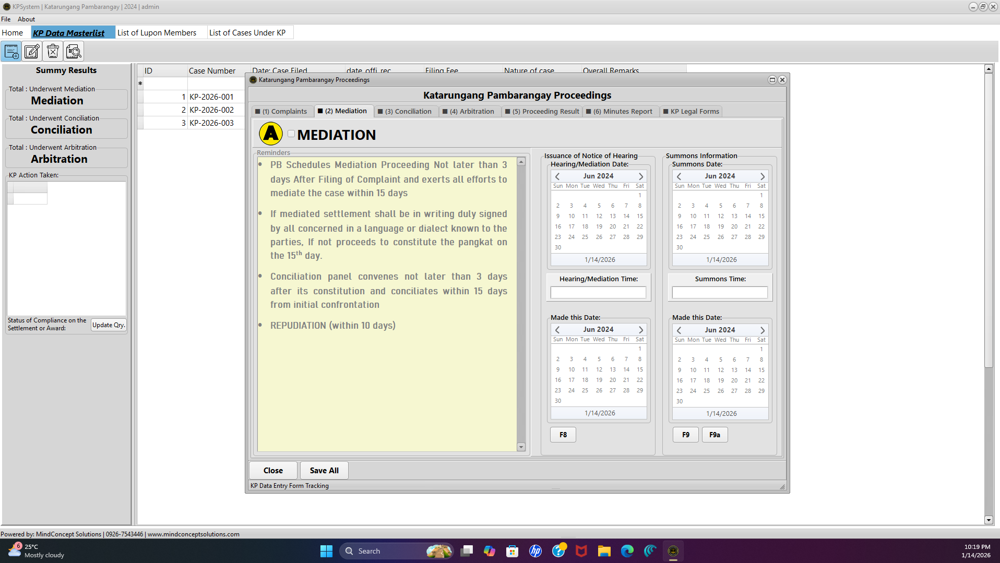

  <h1>⚖️ Katarungang Pambarangay (KP) System</h1>
  <h3>Barangay Justice Case Management System</h3>

  

    A specialized legal management application built with <b>Delphi VCL</b> to digitize the  
    Philippine Barangay Justice System, replacing manual logbooks with a secure, automated workflow.
  

  

    
    
    
    
  

  

 

## 📖 Overview

The **Katarungang Pambarangay System** is a desktop application designed to streamline the dispute resolution process at the barangay level. It ensures compliance with the **Local Government Code of 1991** by standardizing how cases are recorded, processed, and resolved.

From the initial filing of a complaint to the issuance of a **Certificate to File Action**, the system tracks every stage of the lifecycle (Mediation, Conciliation, Arbitration). It eliminates the redundancy of handwriting legal forms by automatically generating **KP Forms 1–25**, ensuring accuracy and consistency in legal documentation.

---

## 🎯 Key Features

| Feature | Description |
| :--- | :--- |
| **📜 Digital Blotter** | Secure entry of complaints including complainant/respondent profiles, blotter numbers, and dispute narratives. |
| **⚖️ Automated KP Forms** | One-click generation of standard legal forms (e.g., *Patawag*, *Summon*, *Amicable Settlement*, *Certificate to File Action*). |
| **🔄 Case Lifecycle** | Tracks case status progression from **Mediation** (Lupon Chairman) to **Conciliation** (Pangkat) and **Arbitration**. |
| **📅 Hearing Scheduler** | Integrated calendar to manage hearing dates, creating alerts for conflicts or upcoming sessions. |
| **📊 Analytics Dashboard** | Visualizes data on crime volume, settlement efficiency, and pending case loads for the DILG quarterly report. |
| **🗄️ Case Archiving** | Searchable database of historical cases with support for attaching scanned evidence documents. |

---

## 📸 System Screenshots

<table>
  <tr>
    <td width="50%">
      <h3 align="center">Blotter Entry Module</h3>
      
    </td>
    <td width="50%">
      <h3 align="center">KP Form Generator</h3>
      
    </td>
  </tr>
  <tr>
    <td width="50%">
      <h3 align="center">Hearing Scheduler</h3>
      
    </td>
    <td width="50%">
      <h3 align="center">Print Preview (Form 7)</h3>
      
    </td>
  </tr>
</table>

---

## 🛠️ Technical Details

* **Language:** Object Pascal (Delphi)
* **Framework:** VCL (Visual Component Library)
* **Database Access:** FireDAC
* **Database Engine:** MySQL (Networked) or SQLite (Local Standalone)
* **Reporting:** FastReport (for KP Forms and DILG Reports)
* **UI Controls:** VCL Styles for modern Windows 10/11 look and feel.

---

## ⚖️ Supported KP Forms
The system automatically populates the following standardized forms:
* **KP Form 7:** Summon for the Respondent
* **KP Form 8:** Notice of Hearing (Complainant)
* **KP Form 9:** Summon
* **KP Form 15:** Arbitration Award
* **KP Form 16:** Amicable Settlement
* **KP Form 18:** Certificate to File Action
* *...and all other forms required by the KP Law.*

---

## 📥 Installation & Setup

1.  **Database Setup:** Import the provided `kp_database.sql` file into your MySQL server (or place the `db.sqlite` file in the app folder).
2.  **Configuration:** Open `config.ini` to set your barangay name, logo path, and database connection string.
3.  **Run:** Launch `KP_System.exe`.
4.  **Login:** Default Admin credentials are `admin` / `admin`.

---

  
Developed by <b>Lance Esureña</b>

  

    
    
  

